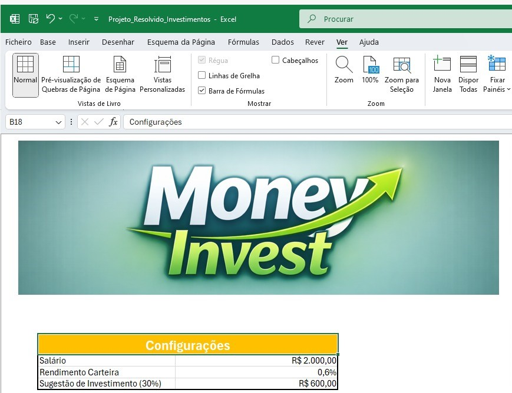
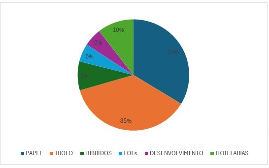

# Simulador de Investimentos em Fundos Imobiliários (FIIs)

## Descrição do Projeto

Este projeto consiste no desenvolvimento de uma planilha em Excel para simulação de investimentos em fundos imobiliários (FIIs). A ferramenta tem como objetivo auxiliar o usuário na tomada de decisões financeiras, permitindo visualizar diferentes cenários de investimento ao longo do tempo.

A simulação é baseada em perguntas iniciais que ajudam a definir o perfil e os objetivos do investidor, possibilitando uma análise mais clara do potencial retorno do investimento.

## Funcionalidades

A planilha permite ao usuário:

- Informar o valor a ser investido mensalmente  
- Definir o período de investimento em anos  
- Inserir a taxa de rendimento mensal  
- Visualizar o patrimônio acumulado ao longo do tempo  
- Calcular os dividendos mensais estimados  

Além disso, a ferramenta utiliza informações básicas para análise, como salário e valores já investidos em carteira, a fim de calcular sugestões de investimento e projetar cenários futuros.

## Perfil do Investidor

O projeto considera diferentes perfis de investidor, permitindo a escolha entre:

- Conservador  
- Moderado  
- Agressivo  

Para isso, foi utilizada uma planilha auxiliar contendo os perfis de investimento, os percentuais sugeridos e os cálculos automáticos dos valores correspondentes a cada perfil.

## Visualização de Dados

A planilha apresenta gráficos que auxiliam na visualização dos possíveis cenários de investimento, facilitando a análise e a comparação dos resultados de acordo com o perfil selecionado.

## Objetivos de Aprendizagem

Com o desenvolvimento deste projeto, foram aplicados os seguintes conceitos:

- Criação de ferramentas de simulação de investimentos em Excel  
- Aplicação de cálculos financeiros, como rendimento mensal e dividendos  
- Organização e documentação de processos técnicos  
- Utilização do GitHub para compartilhamento de documentação técnica
  ## Screenshots da Planilha

### Tela Inicial da Simulação

### Seleção do Perfil do Investidor

### Gráfico de Investimentos

